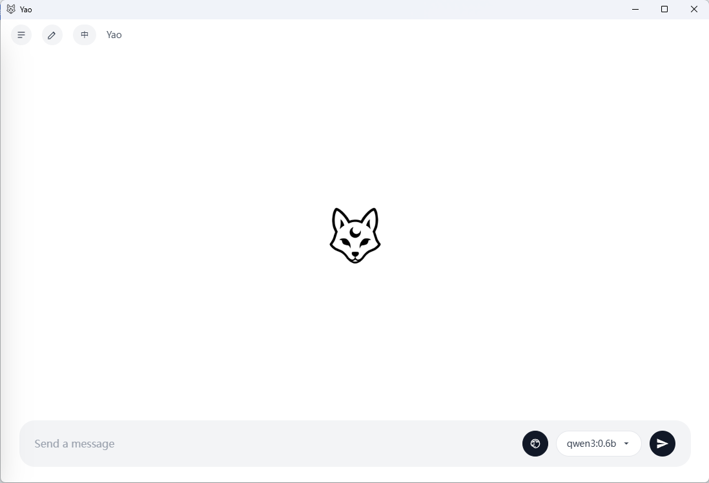
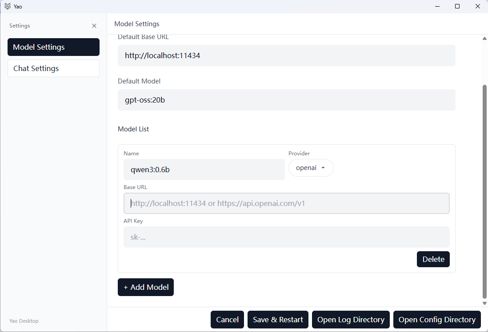

# Yao - 轻量级AI聊天助手 / Lightweight AI Chat Assistant

<div align="center">


**🚀 仅6MB的单文件AI聊天客户端 | Only 6MB Single-File AI Chat Client**

[](https://opensource.org/licenses/MIT)
[](https://tauri.app/)
[](https://reactjs.org/)
[](https://www.rust-lang.org/)

[English](#english) | [中文](#中文)

</div>

---

## 中文

### ✨ 项目特色

**超轻量级设计** - 整个应用仅 **6MB** 单个可执行文件，无需安装，即开即用！

🎯 **核心优势**
- 📦 **极致轻量**：单个exe文件，仅6MB，绿色免安装
- 🌍 **双语支持**：完整的中英文界面切换
- 🧠 **思考模式**：支持AI推理过程可视化（Think模式）
- ⚡ **流式输出**：实时显示AI回复，体验流畅
- 🔧 **多模型支持**：同时支持Ollama本地模型和OpenAI API
- 💾 **会话保存**：自动保存聊天历史，随时回溯
- 🎨 **现代UI**：简洁美观的聊天界面设计

### 🖼️ 界面预览

#### 主界面 - 简洁优雅的聊天体验


#### 设置界面 - 灵活的配置选项


### 🚀 快速开始

#### 方式一：下载可执行文件（推荐）
1. 从 [Releases](../../releases) 下载最新版本的 `yao.exe`
2. 双击运行，无需安装任何依赖
3. 开始使用！

#### 方式二：从源码运行
1. **克隆项目**
   ```bash
   git clone https://github.com/your-username/TautiOllama.git
   cd TautiOllama
   ```

2. **安装依赖**
   ```bash
   npm install
   ```

3. **启动开发服务器**
   ```bash
   npm run tauri:dev
   ```

4. **构建发布版本**
   ```bash
   ./release.bat
   ```

### 🔧 功能特性

#### 🤖 AI模型支持
- **Ollama本地模型**：支持本地部署的开源大语言模型
- **OpenAI API**：支持GPT系列模型
- **多模型配置**：可同时配置多个不同的模型和API端点

#### 💭 智能对话
- **Think模式**：可视化AI的思考过程，了解推理逻辑
- **流式输出**：实时显示回复内容，无需等待
- **上下文管理**：智能管理对话上下文，支持长对话

#### 🎨 用户体验
- **双语界面**：完整的中英文切换，设置持久保存
- **会话管理**：自动保存聊天记录，支持历史会话回溯
- **响应式设计**：适配不同屏幕尺寸
- **深色/浅色主题**：护眼的界面设计

#### ⚙️ 高级配置
- **温度控制**：调节AI回复的创造性程度
- **上下文长度**：自定义对话上下文消息数量
- **API密钥管理**：安全的密钥存储和管理
- **日志系统**：详细的运行日志，便于调试

### 🛠️ 技术架构

- **前端**：React 18 + TypeScript + Tailwind CSS
- **后端**：Rust + Tauri 2.0
- **状态管理**：Zustand
- **国际化**：自定义i18n解决方案
- **构建工具**：Vite + Cargo

### 📋 系统要求

- **Windows**: Windows 10/11 (x64)
- **内存**: 最低 2GB RAM
- **磁盘空间**: 10MB 可用空间
- **网络**: 使用OpenAI API时需要网络连接

### 🗺️ 开发路线图

#### 🔜 即将推出
- [ ] **MCP (Model Context Protocol)** 集成
  - 支持标准化的模型上下文协议
  - 更好的跨平台模型兼容性
  
- [ ] **多Agent系统**
  - Agent角色定义和管理
  - 多Agent协作对话
  - 专业领域Agent模板

- [ ] **插件系统**
  - 自定义功能插件
  - 社区插件市场
  - 插件开发API

#### 🔮 未来计划
- [ ] **语音交互**
  - 语音输入支持
  - 语音合成输出
  - 多语言语音识别

- [ ] **文件处理**
  - 文档上传和解析
  - 图片识别和分析
  - 代码文件智能处理

- [ ] **云同步**
  - 跨设备会话同步
  - 配置云端备份
  - 团队协作功能

### 🤝 贡献指南

我们欢迎所有形式的贡献！

1. Fork 本仓库
2. 创建功能分支 (`git checkout -b feature/AmazingFeature`)
3. 提交更改 (`git commit -m 'Add some AmazingFeature'`)
4. 推送到分支 (`git push origin feature/AmazingFeature`)
5. 创建 Pull Request

### 📄 许可证

本项目采用 MIT 许可证 - 查看 [LICENSE](LICENSE) 文件了解详情

### 🙏 致谢

- [Tauri](https://tauri.app/) - 跨平台应用开发框架
- [React](https://reactjs.org/) - 用户界面库
- [Tailwind CSS](https://tailwindcss.com/) - CSS框架
- [Ollama](https://ollama.ai/) - 本地AI模型运行时

---

## English

### ✨ Project Features

**Ultra-Lightweight Design** - The entire application is only **6MB** as a single executable file, no installation required, ready to use!

🎯 **Core Advantages**
- 📦 **Extremely Lightweight**: Single exe file, only 6MB, portable and installation-free
- 🌍 **Bilingual Support**: Complete Chinese/English interface switching
- 🧠 **Think Mode**: AI reasoning process visualization support
- ⚡ **Streaming Output**: Real-time AI response display with smooth experience
- 🔧 **Multi-Model Support**: Support both local Ollama models and OpenAI API
- 💾 **Session Saving**: Automatic chat history saving with conversation backtracking
- 🎨 **Modern UI**: Clean and elegant chat interface design

### 🖼️ Interface Preview

#### Main Interface - Clean and Elegant Chat Experience


#### Settings Interface - Flexible Configuration Options


### 🚀 Quick Start

#### Method 1: Download Executable (Recommended)
1. Download the latest `yao.exe` from [Releases](../../releases)
2. Double-click to run, no dependencies required
3. Start using!

#### Method 2: Run from Source
1. **Clone Repository**
   ```bash
   git clone https://github.com/your-username/TautiOllama.git
   cd TautiOllama
   ```

2. **Install Dependencies**
   ```bash
   npm install
   ```

3. **Start Development Server**
   ```bash
   npm run tauri:dev
   ```

4. **Build Release Version**
   ```bash
   ./release.bat
   ```

### 🔧 Feature Highlights

#### 🤖 AI Model Support
- **Local Ollama Models**: Support for locally deployed open-source LLMs
- **OpenAI API**: Support for GPT series models
- **Multi-Model Configuration**: Configure multiple different models and API endpoints simultaneously

#### 💭 Intelligent Conversation
- **Think Mode**: Visualize AI's reasoning process and understand logic
- **Streaming Output**: Real-time response display without waiting
- **Context Management**: Smart conversation context management with long dialogue support

#### 🎨 User Experience
- **Bilingual Interface**: Complete Chinese/English switching with persistent settings
- **Session Management**: Automatic chat record saving with conversation history backtracking
- **Responsive Design**: Adapt to different screen sizes
- **Dark/Light Theme**: Eye-friendly interface design

#### ⚙️ Advanced Configuration
- **Temperature Control**: Adjust AI response creativity level
- **Context Length**: Customize conversation context message count
- **API Key Management**: Secure key storage and management
- **Logging System**: Detailed runtime logs for debugging

### 🛠️ Technical Architecture

- **Frontend**: React 18 + TypeScript + Tailwind CSS
- **Backend**: Rust + Tauri 2.0
- **State Management**: Zustand
- **Internationalization**: Custom i18n solution
- **Build Tools**: Vite + Cargo

### 📋 System Requirements

- **Windows**: Windows 10/11 (x64)
- **Memory**: Minimum 2GB RAM
- **Disk Space**: 10MB available space
- **Network**: Internet connection required when using OpenAI API

### 🗺️ Development Roadmap

#### 🔜 Coming Soon
- [ ] **MCP (Model Context Protocol)** Integration
  - Support for standardized model context protocol
  - Better cross-platform model compatibility
  
- [ ] **Multi-Agent System**
  - Agent role definition and management
  - Multi-agent collaborative conversations
  - Professional domain agent templates

- [ ] **Plugin System**
  - Custom functionality plugins
  - Community plugin marketplace
  - Plugin development API

#### 🔮 Future Plans
- [ ] **Voice Interaction**
  - Voice input support
  - Speech synthesis output
  - Multi-language speech recognition

- [ ] **File Processing**
  - Document upload and parsing
  - Image recognition and analysis
  - Smart code file processing

- [ ] **Cloud Sync**
  - Cross-device session synchronization
  - Cloud configuration backup
  - Team collaboration features

### 🤝 Contributing

We welcome all forms of contributions!

1. Fork the repository
2. Create a feature branch (`git checkout -b feature/AmazingFeature`)
3. Commit your changes (`git commit -m 'Add some AmazingFeature'`)
4. Push to the branch (`git push origin feature/AmazingFeature`)
5. Create a Pull Request

### 📄 License

This project is licensed under the MIT License - see the [LICENSE](LICENSE) file for details

### 🙏 Acknowledgments

- [Tauri](https://tauri.app/) - Cross-platform application development framework
- [React](https://reactjs.org/) - User interface library
- [Tailwind CSS](https://tailwindcss.com/) - CSS framework
- [Ollama](https://ollama.ai/) - Local AI model runtime

---

<div align="center">

**⭐ 如果这个项目对你有帮助，请给我们一个星标！**

**⭐ If this project helps you, please give us a star!**

</div>